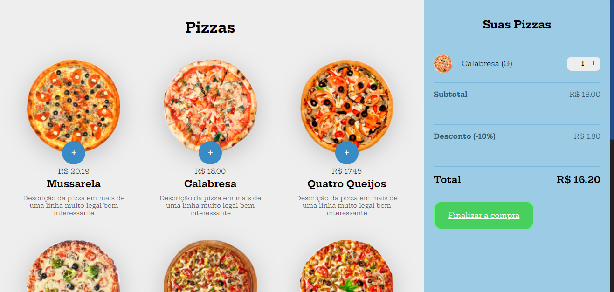

<div align="center" id="top"> 
  

  &#xa0;

  <!-- <a href="https://pizza_base.netlify.com">Demo</a> -->
</div>

<h1 align="center">Pizza Base</h1>

<p align="center">
  

  

  

  

  <!--  -->

  <!--  -->

  <!--  -->
</p>

<p align="center">
  <a href="#dart-sobre">Sobre</a> &#xa0; | &#xa0; 
  
  <a href="#rocket-tecnologias">Tecnologias</a> &#xa0; | &#xa0;
  <a href="#white_check_mark-pré-requesitos">Pré requisitos</a> &#xa0; | &#xa0;
  <a href="#checkered_flag-começando">Começando</a> &#xa0; | &#xa0;
  <a href="https://github.com/Gabriel4420" target="_blank">Autor</a>
</p>

<br>

## :dart: Sobre ##

Projeto desenvolvido com o auxilio do professor bonieky lacerda no curso de javascript, para o entendimento de conceitos básicos sobre a linguagem.

## :rocket: Tecnologias ##

As seguintes ferramentas foram usadas na construção do projeto:

- [Javascript](https://b7web.com.br)


## :checkered_flag: Começando ##

```bash
# Clone este repositório
$ git clone https://github.com/Gabriel4420/pizza_base

```

Feito com :heart: por <a href="https://github.com/Gabriel4420" target="_blank">Gabriel Rodrigues Perez</a>

&#xa0;

<a href="#top">Voltar para o topo</a>
